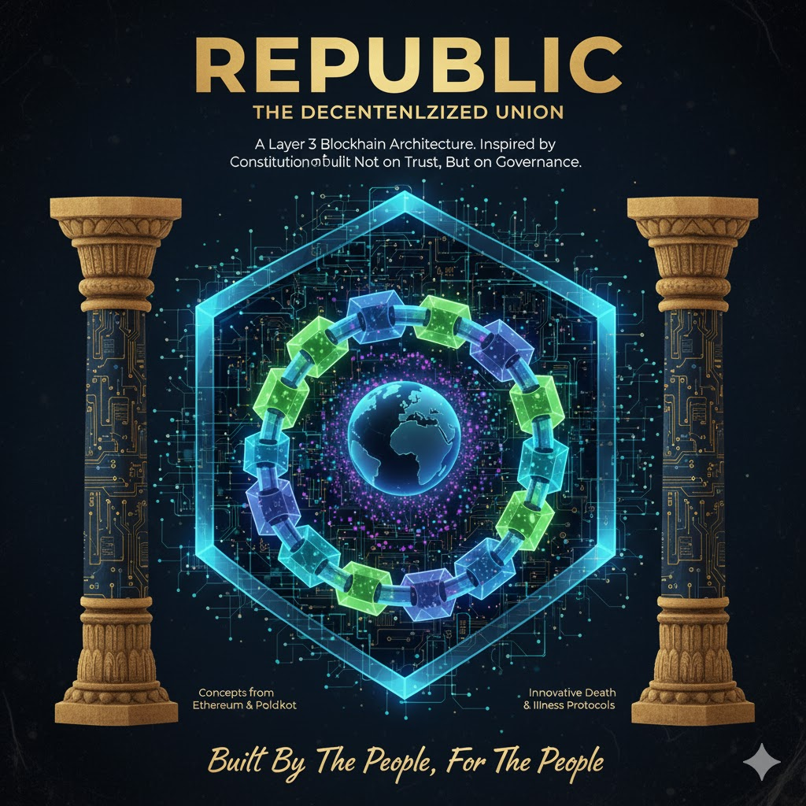

# Republic
> 26.10.2025
> Rohan Sen

> Research: https://docs.google.com/document/d/1O56NVFjksS61MN-pBA3JaxpH8PHYU2sU4XcXkTS9cr4/edit?usp=sharing
> Github: https://github.com/republic-chain
> Author: https://rcsen.vercel.app

Republic would be a unique blockchain network, which closely mimics the Democracy or Republic we can observe in the real world. It’s going to follow concepts from the Constitution of India into the logical theories of the blockchain, wherever possible. Things like Death or Illness which are absent in case of technology, We are going to try and implement real-world implementations for them too, (only if possible of course!).
This would be a Layer 3 blockchain architecture, and the plan is to follow examples from Ethereum and Polkadot.
Rather than being built on trust, this would rather be built upon a Republic system which would be an entirely new theory over the implementations of blockchain.